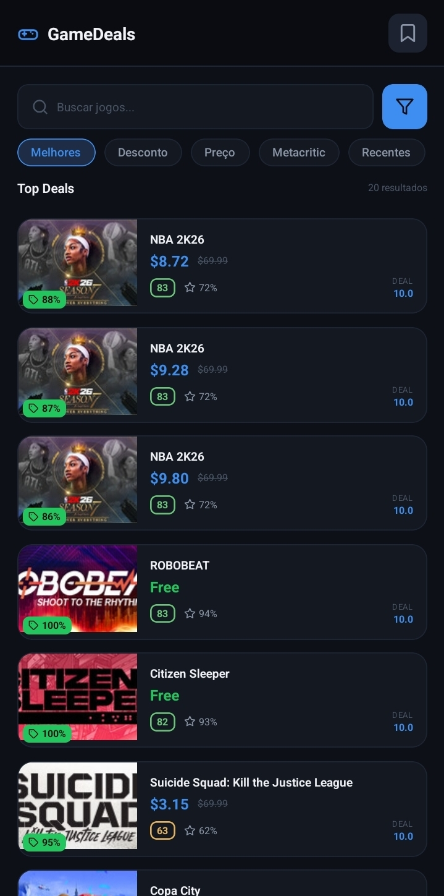
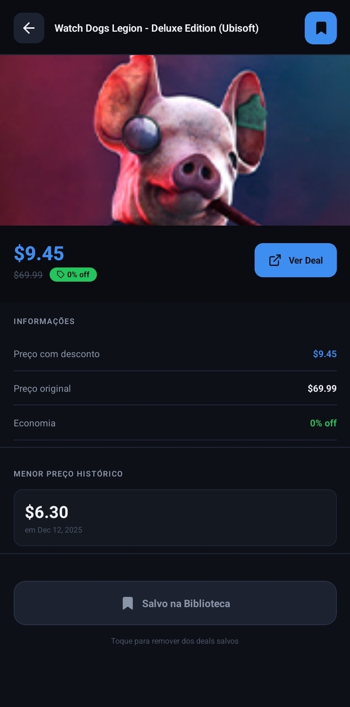
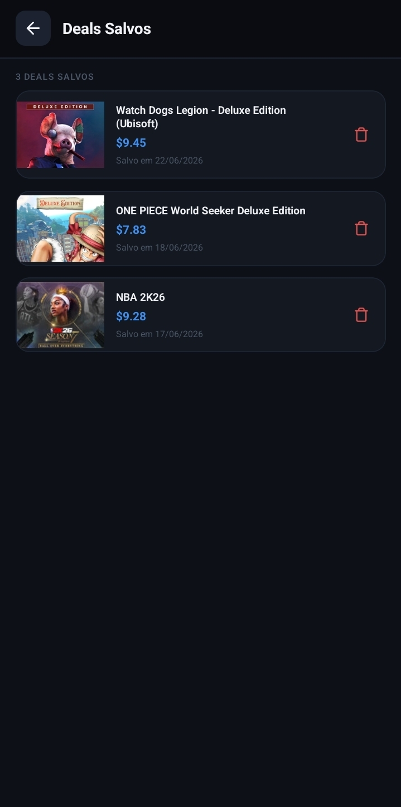

# GameDeals

Aplicativo mobile desenvolvido com **React Native + Expo** para a disciplina de Desenvolvimento Mobile e IoT (UNIVALE). O app consome a [CheapShark API](https://apidocs.cheapshark.com/) para exibir promoções de jogos para PC e permite salvar deals favoritos localmente via SQLite.

---

## Funcionalidades

- **Lista de deals** — exibe promoções ativas de jogos consumidas via API, apresentadas em cards com imagem, preço original, preço promocional e percentual de desconto
- **Detalhe do deal** — ao tocar em um card, o usuário acessa informações completas: avaliações Metacritic e Steam, menor preço histórico, disponibilidade em outras lojas e botão para abrir o link da oferta
- **Banco de dados local** — na tela de detalhe, um botão "Salvar na Biblioteca" armazena o deal no SQLite do dispositivo; os deals salvos podem ser acessados e removidos na tela dedicada

---

## Tecnologias utilizadas

| Tecnologia | Versão | Uso |
|---|---|---|
| React Native | 0.83.6 | Framework principal |
| Expo | ~55.0.0 | Toolchain e runtime |
| expo-sqlite | ~55.0.16 | Banco de dados local |
| @react-navigation/native-stack | ^6.11.0 | Navegação entre telas |
| react-native-svg | 15.15.3 | Ícones vetoriais |
| TypeScript | ~5.9.2 | Tipagem estática |

---

## Estrutura do projeto

```
GameDeals/
├── index.js                        # Entrada da aplicação
├── App.tsx                         # Configuração da navegação
├── app.json                        # Configuração do Expo
├── babel.config.js
│
├── src/
│   ├── theme.ts                    # Cores, espaçamentos e tipografia
│   ├── types/
│   │   └── index.ts                # Interfaces TypeScript (Deal, SavedDeal, etc.)
│   ├── services/
│   │   ├── api.ts                  # Funções de consumo da CheapShark API
│   │   └── database.ts             # CRUD SQLite (salvar, remover, listar)
│   ├── components/
│   │   ├── Icons.tsx               # Ícones SVG
│   │   └── DealCard.tsx            # Card reutilizável da lista
│   └── screens/
│       ├── DealsScreen.tsx         # Tela 1 — lista de deals
│       ├── DealDetailScreen.tsx    # Tela 2 — detalhe do deal
│       └── SavedScreen.tsx         # Tela 3 — deals salvos
│
└── assets/                         # Ícones e imagens do app
```

---

## API utilizada

**CheapShark API** — `https://www.cheapshark.com/api/1.0`

| Endpoint | Descrição |
|---|---|
| `GET /deals` | Lista de promoções ativas com filtros de ordenação, preço e título |
| `GET /deals?id={dealID}` | Detalhes completos de um deal específico |

Não é necessária chave de autenticação.

---

## Como executar

### Pré-requisitos

- [Node.js](https://nodejs.org/) 18 ou superior
- [Expo Go](https://expo.dev/go) instalado no celular Android

### Instalação

```bash
# 1. Clone ou extraia o projeto
cd GameDeals

# 2. Instale as dependências
npm install --legacy-peer-deps

# 3. Inicie o servidor de desenvolvimento
npx expo start --clear
```

Escaneie o QR code exibido no terminal com o Expo Go. O celular e o computador precisam estar na mesma rede Wi-Fi.

---

## Gerar APK

Para gerar um APK instalável sem depender do Expo Go, utilize o **EAS Build**:

```bash
# 1. Instale o EAS CLI globalmente
npm install -g eas-cli

# 2. Faça login na sua conta Expo (crie em expo.dev se necessário)
eas login

# 3. Configure o projeto (apenas na primeira vez)
eas build:configure

# 4. Gere o APK
eas build --platform android --profile preview
```

Ao final do processo, um link para download do `.apk` será exibido. O arquivo pode ser instalado diretamente no dispositivo Android.

> A conta gratuita do Expo permite 30 builds por mês.

---

## Banco de dados local

O app usa **expo-sqlite** para persistência local. A tabela `saved_deals` é criada automaticamente na primeira execução:

```sql
CREATE TABLE IF NOT EXISTS saved_deals (
  id          INTEGER PRIMARY KEY AUTOINCREMENT,
  dealID      TEXT UNIQUE NOT NULL,
  title       TEXT NOT NULL,
  salePrice   TEXT NOT NULL,
  normalPrice TEXT NOT NULL,
  savings     TEXT NOT NULL,
  thumb       TEXT NOT NULL,
  savedAt     TEXT NOT NULL
);
```

As operações disponíveis são: salvar deal, remover deal, listar todos os deals salvos e verificar se um deal já está salvo.

---

## Telas

### Deals (tela principal)
Lista de promoções ativas carregada da API. Suporta busca por título e ordenação por avaliação do deal, percentual de desconto, preço, nota Metacritic ou data de atualização. Scroll infinito com paginação automática.

### Detalhe do deal
Exibe imagem em destaque, preço com desconto, preço original, percentual de economia, avaliações Metacritic e Steam, menor preço histórico registrado e disponibilidade em outras lojas. Botão "Ver Deal" abre o link da promoção no navegador. Botão "Salvar na Biblioteca" persiste o deal no SQLite local.

### Deals salvos
Lista todos os deals armazenados localmente com data de salvamento. Permite remover individualmente via botão de lixeira com confirmação. Tocar no card navega para a tela de detalhe.

---

## Requisitos atendidos

| Requisito | Pontuação | Implementação |
|---|---|---|
| Lista de itens via API com lista/card | 3,75 pts | `DealsScreen` consome `GET /deals` e exibe cards |
| Acesso ao detalhe com toque no item | 3,75 pts | Toque no card navega para `DealDetailScreen` |
| Botão para salvar no SQLite local | 7,5 pts | Botão "Salvar na Biblioteca" em `DealDetailScreen` |

**Total: 15 pts**



